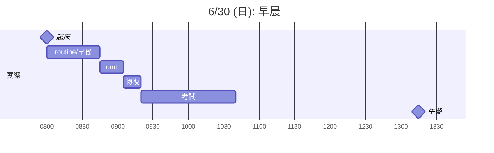

# 今日規劃
![[2024-06-29#Tomorrow (6/30) Planning]]
# TODO
- [/] 訂正考卷
- [x] 物：基本反應總集 + 翻卡 (因次分析、駐波、干涉、電磁場...) ✅ 2024-06-30
- [x] 化：基本反應總集 + 翻卡
- [x] 數：複盤以前的筆記 + 翻卡 ✅ 2024-07-01
## 細項
### PHYSICS
- [x] 能階差記憶 -> [[C4-2-技巧：能階差]] ✅ 2024-06-30
- [x] 開管/閉管樂器諧音公式 [[P10-2 聲音的共鳴與駐波]] ✅ 2024-06-30
- [x] 電流磁效應 ✅ 2024-06-30
# 實際
0800-0845 routine/早餐
0845-0905 cmt
0905-0920 複習...
...
'1210-1250 午餐
...-1615 TEST
1650-1840 @LOUISA 訂物
NOTE: 1800 finished a cup of espresso
- [-] 在臥室做明日規劃
# Mermaid Gantt Graph

# 7/1 Planning
- 去拜拜
- 訂 M-H109, C-H109
- 完成[[2024-06-30]] 的 [[#TODO]]