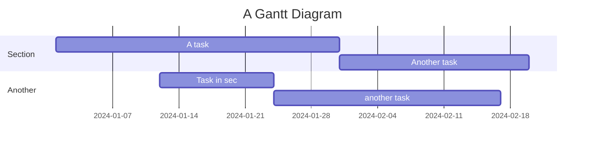
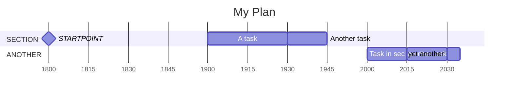

# Example

```mermaid height=379,auto
gantt
    title A Gantt Diagram
    dateFormat  YYYY-MM-DD
    section Section
    A task           :a1, 2024-01-01, 30d
    Another task     :after a1  , 20d
    section Another
    Task in sec      :2024-01-12  , 12d
    another task      : 24d
```
# Implemention
ref: https://mermaid.js.org/syntax/gantt.html#milestones

```mermaid height=379,auto
---
displayMode: compact
---
gantt
    title My Plan
    dateFormat HHmm
    axisFormat %H%M
    section SECTION
    STARTPOINT: milestone, 1800, 0m
    A task           :a1, 1900, 30m
    Another task     :after a1  , 15m
    section ANOTHER
    Task in sec      :2000  , 15m
    another task      : 15m
    yet another: 5m
```
