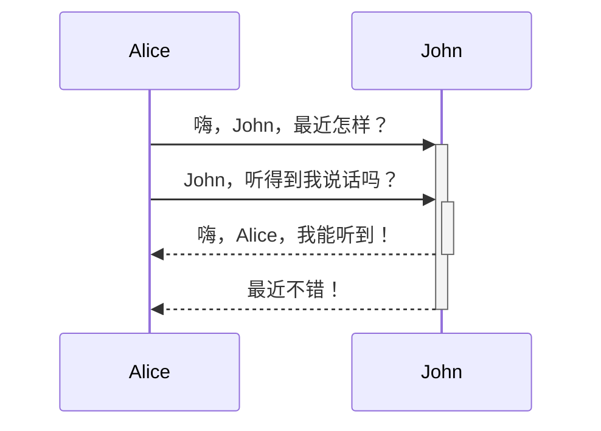
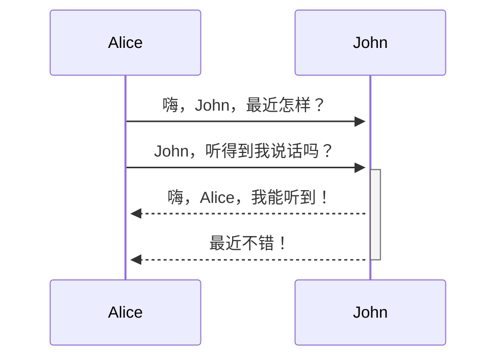

#測試
![[測試頁 2024-04-03 16.44.19.excalidraw]]
# quite

What the faaaaaaaaaaaaa ^Shell

$$
\vec \tau = I \vec A \times \vec B
$$
$$ $$

# 行咧測試
This is a text. [^ㄓ行上小標]

[^ㄓ行上小標]: True

# Ted Talks are dangerously eloquent

Or, as [[Hamlet]] would say, “full of sound and fury, signifying nothing”.

A perfect example is the talk called “How to sound smart in your TEDx Talk”. [^2]

Eloquent talks trick us into thinking we learn more than we actually do.

They make us feel good without really improving us. [^1]

[^1]: [[Human Rites]] p80

[^2]: https://www.youtube.com/watch?v=8S0FDjFBj8o

**粗體字 bold**
*斜體字 Italic*

A
-------
What do you mean

# checkboxes
- [] ...
This does not work

- [ ]
This does not work either

- [ ] ...
This one works!

# Footnote
This is invalid[^invalid]
[^invalid]: Invalid example

This is valid[^valid]

[^valid]: valid example

# Latex align
$$\begin{align*}
asdf&& Ohh && Now I getit\\
asdf&& wasd\\
HUHUHUHHH???
\end{align*}$$
$$\begin{flalign}
\text{Ok so this is it.}\\
\text{It's just like this:}&&
\end{flalign}$$

# Flashcard Test
#flashcards 
So this :: works here too?
<!--SR:!2024-04-20,1,230-->

# Picture size
![[1714625387502_124953.jpg|500x300]]